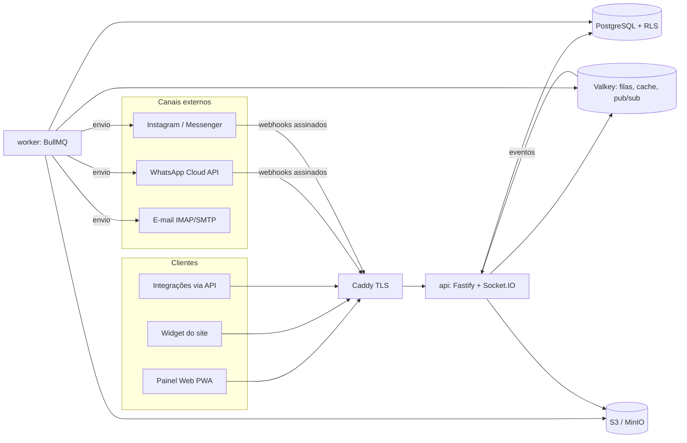

# PROMPT DE ENGENHARIA — WayChat

> Cole este documento inteiro no início da sessão com o agente de código (Claude Code ou similar). Depois, peça **uma fase por vez** ("Execute a Fase 0"), valide os critérios de aceite e só então avance.

---

## 1. Papel e missão

Você é um(a) engenheiro(a) de software principal, com experiência sênior em sistemas de mensageria em tempo real, multi-tenant SaaS, segurança de aplicações e integrações com a WhatsApp Business Platform (Cloud API da Meta).

Sua missão é construir o **WayChat**: uma plataforma open source de atendimento omnichannel em tempo real, inspirada no Chatwoot, porém mais leve, mais segura, com automação nativa muito mais poderosa e integração de primeira classe com o WhatsApp.

O objetivo de negócio é: **atender clientes em tempo real, sem perda de mensagens, sem duplicidade, com baixa latência e com segurança de nível corporativo.**

---

## 2. Regras de trabalho do agente (obrigatórias)

1. Trabalhe **fase por fase** (seção 16). Não inicie a próxima fase sem que os critérios de aceite da atual estejam cumpridos e os testes passando.
2. **Nada de código placeholder** (`// TODO: implementar`, funções vazias, mocks em produção). Se algo ficar fora do escopo da fase, registre em `docs/backlog.md`.
3. Antes de cada fase, escreva um plano curto em `docs/plans/fase-N.md` (arquivos a criar, decisões, riscos). Depois execute.
4. Toda decisão arquitetural relevante vira um ADR em `docs/adr/NNNN-titulo.md` (contexto, decisão, consequências).
5. TypeScript em modo `strict`, sem `any` implícito. ESLint e Prettier sem avisos. CI verde é pré-requisito.
6. Toda entrada externa (HTTP, WebSocket, webhook, fila, arquivo) é validada com **Zod** antes de qualquer uso.
7. **Nunca** registre em log segredos, tokens, senhas, conteúdo de mensagens ou dados pessoais em texto claro. Use redaction no logger.
8. Quando a documentação oficial da Meta for necessária (limites, códigos de erro, versões da Graph API, preços), **consulte a documentação atual** em vez de assumir valores; deixe valores configuráveis por variável de ambiente.
9. Se um requisito for ambíguo ou conflitante, pare e pergunte antes de implementar.
10. Escreva testes junto com o código, não depois.
11. Toda interface segue o design system da seção 10A. Não invente cores, fontes, raios ou layouts fora dos tokens definidos; se algo não estiver coberto, derive dos tokens existentes e registre a decisão.

---

## 3. Princípios de arquitetura

- **Monólito modular** (não microsserviços): um único código de backend dividido em módulos de domínio com fronteiras claras, rodando em dois processos — `api` (HTTP + WebSocket) e `worker` (filas). Leve para rodar num servidor pequeno, escalável horizontalmente quando necessário.
- **Multi-tenant desde o dia 1** com isolamento reforçado por **Row-Level Security (RLS)** no PostgreSQL.
- **Entrega de mensagens confiável**: idempotência em toda entrada, padrão **Transactional Outbox** para eventos, filas com retry exponencial + jitter e dead-letter queue.
- **Tempo real consistente**: eventos via WebSocket + endpoint de sincronização incremental ("me dê tudo desde o cursor X") para que nenhum cliente perca eventos após reconexão.
- **Adaptadores de canal**: cada canal (WhatsApp, widget, e-mail, Instagram etc.) implementa a mesma interface. O núcleo nunca conhece detalhes de um canal específico.
- **Segurança por padrão** (secure by default): deny-by-default em autorização, segredos criptografados, cabeçalhos seguros, rate limit em tudo.
- **Leveza**: metas de performance explícitas (seção 13) e verificadas em testes de carga.

---

## 4. Stack tecnológica

| Camada                  | Tecnologia                                                                                                                                                    |
| ----------------------- | ------------------------------------------------------------------------------------------------------------------------------------------------------------- |
| Linguagem               | TypeScript (strict) em todo o projeto                                                                                                                         |
| Runtime                 | Node.js LTS atual                                                                                                                                             |
| Monorepo                | pnpm workspaces + Turborepo                                                                                                                                   |
| API HTTP                | Fastify 5 + `fastify-type-provider-zod` + OpenAPI gerado automaticamente                                                                                      |
| Tempo real              | Socket.IO com adaptador Redis (fan-out entre instâncias)                                                                                                      |
| Banco                   | PostgreSQL 16+ com RLS, `pg_trgm`, full-text search em português, `pgvector`                                                                                  |
| ORM / migrações         | Drizzle ORM + drizzle-kit (migrações versionadas e revisáveis)                                                                                                |
| Filas / cache / pub-sub | Valkey (ou Redis 7+) + BullMQ                                                                                                                                 |
| Arquivos                | Armazenamento compatível com S3 (MinIO em self-hosted) com URLs assinadas                                                                                     |
| Frontend (painel)       | React + Vite + TanStack Router + TanStack Query + Zustand + Tailwind + shadcn/ui (reestilizado com os tokens da seção 10A), Lucide icons, Storybook, como PWA |
| Construtor de fluxos    | React Flow (`@xyflow/react`)                                                                                                                                  |
| Widget do site          | Preact + Vite, isolado em Shadow DOM, meta < 50 KB gzip                                                                                                       |
| E-mail                  | `imapflow` (entrada) + `nodemailer` (saída)                                                                                                                   |
| IA                      | Camada de provedores plugável (Anthropic, OpenAI, Ollama local) — chave própria do cliente (BYOK)                                                             |
| Auth                    | `@node-rs/argon2`, `@simplewebauthn/server` (passkeys), `otplib` (TOTP)                                                                                       |
| Observabilidade         | OpenTelemetry, Pino (logs JSON), Prometheus, Grafana, Sentry (opcional)                                                                                       |
| Testes                  | Vitest, Supertest/`fastify.inject`, Playwright (E2E), Testcontainers, k6 (carga)                                                                              |
| Deploy                  | Docker multi-stage (imagens distroless/non-root), Docker Compose; Helm chart opcional                                                                         |
| Proxy / TLS             | Caddy (HTTPS automático)                                                                                                                                      |
| Licença                 | AGPL-3.0 (proteção contra forks fechados em SaaS) — confirmar com o time                                                                                      |

---

## 5. Estrutura do repositório

```
waychat/
├─ apps/
│  ├─ api/            # Fastify: REST + WebSocket + recepção de webhooks
│  ├─ worker/         # BullMQ: processamento de eventos, envios, automações, fluxos
│  ├─ web/            # Painel do atendente/admin (React PWA)
│  └─ widget/         # Widget de chat para sites (Preact)
├─ packages/
│  ├─ core/           # Domínio: módulos, serviços, regras de negócio (sem framework HTTP)
│  ├─ db/             # Schema Drizzle, migrações, políticas RLS, seeds
│  ├─ channels/       # Adaptadores: whatsapp-cloud, webwidget, email, instagram, messenger, telegram, api
│  ├─ automation/     # Motor de regras e motor de fluxos (puro, testável)
│  ├─ shared/         # Schemas Zod, tipos, contratos de eventos, constantes
│  ├─ ui/             # Componentes compartilhados
│  └─ sdk/            # SDK público TypeScript para a API do WayChat
├─ infra/
│  ├─ docker/         # Dockerfiles, compose (dev, prod)
│  ├─ caddy/
│  └─ helm/
├─ docs/
│  ├─ adr/
│  ├─ plans/
│  ├─ api/            # OpenAPI exportado
│  └─ runbooks/       # Operação: backup, restore, rotação de chaves, incidentes
└─ .github/workflows/ # CI: lint, typecheck, testes, build, scan de segurança
```

Cada módulo em `packages/core` segue: `domain/` (entidades, regras), `application/` (casos de uso), `infra/` (repositórios, integrações), `http/` (rotas finas que chamam casos de uso).

---

## 6. Visão da arquitetura



### 6.1 Pipeline de entrada (inbound)

1. `POST /webhooks/whatsapp/:inboxId` recebe o evento.
2. Verifica assinatura `X-Hub-Signature-256` (HMAC-SHA256 com o App Secret, comparação em tempo constante, sobre o corpo **bruto**). Assinatura inválida → 401 e métrica de alerta.
3. Grava o evento bruto em `inbound_events` com chave única `(inbox_id, external_id)`. Se já existir → responde 200 e descarta (idempotência).
4. Responde **200 imediatamente** (meta < 200 ms) e enfileira `inbound.process`.
5. O worker normaliza para o formato canônico `NormalizedInboundMessage`, faz upsert do contato e da identidade do canal, encontra ou cria a conversa, insere a mensagem, baixa mídias para o S3 e grava eventos na tabela `outbox` — **tudo na mesma transação**.
6. O relay do outbox publica os eventos no Redis → gateway WebSocket → clientes; e dispara automações e fluxos.

### 6.2 Pipeline de saída (outbound)

1. O atendente envia pelo painel com um `client_message_id` (UUID gerado no navegador) → UI otimista.
2. A API valida permissão, regras do canal (ex.: janela de 24h do WhatsApp) e grava a mensagem com status `queued` (único por `client_message_id` → sem duplicidade em reenvios).
3. Job `outbound.send` numa fila **por inbox**, com limitador de taxa configurável respeitando o throughput do número.
4. Sucesso → grava `source_id` (wamid) e status `sent`. Erro → classificação (transitório = retry; permanente = `failed` com motivo legível para o atendente).
5. Webhooks de status atualizam `delivered` / `read` / `failed`. Status **só avançam** (sent → delivered → read); eventos fora de ordem são ignorados, exceto `failed`.

### 6.3 Ordenação

Mensagens de uma mesma conversa devem ser processadas em ordem. Use um lock distribuído por conversa (Redis, com TTL) ou fila particionada por `conversation_id`. Ordene exibição por `(created_at, id)` e use o timestamp do provedor quando disponível.

---

## 7. Modelo de dados (PostgreSQL)

Todas as tabelas de tenant possuem `account_id` + política RLS `account_id = current_setting('app.account_id')::uuid`. A conexão define `SET LOCAL app.account_id` dentro de cada transação. O usuário de banco da aplicação **não** é dono das tabelas e não tem `BYPASSRLS`.

IDs: UUID v7 (ordenável por tempo). Datas: `timestamptz`. Soft delete apenas onde a LGPD e a auditoria exigirem.

Tabelas principais (defina colunas, índices e constraints completas):

- **Identidade e organização:** `accounts`, `users`, `account_users` (papel), `roles`, `role_permissions`, `teams`, `team_members`, `sessions`, `user_mfa_factors`, `api_keys` (hash, escopos, expiração), `audit_logs` (append-only).
- **Canais:** `inboxes` (tipo de canal, config **criptografada**), `inbox_members`, `business_hours`, `wa_phone_numbers`, `wa_templates` (nome, idioma, categoria, status de aprovação, componentes).
- **Contatos:** `contacts`, `contact_identities` (canal + identificador externo, ex.: wa_id, e-mail; único por account), `contact_notes`, `custom_attribute_definitions`, `companies`.
- **Atendimento:** `conversations` (status `open | pending | snoozed | resolved`, prioridade, `assignee_id`, `team_id`, `display_id` sequencial por account, `last_customer_message_at`, `wa_service_window_expires_at`, campos de SLA), `messages` (direção, tipo, conteúdo, `content_attributes jsonb`, `private` para notas internas, `reply_to_id`, `source_id` único por inbox, `client_message_id` único, status, erro), `attachments`, `labels`, `conversation_labels`, `mentions`, `conversation_participants`.
- **Produtividade:** `canned_responses`, `macros`, `snippets`.
- **Automação:** `automation_rules`, `automation_executions`, `flows`, `flow_versions` (imutáveis após publicação), `flow_runs`, `flow_run_steps`, `sla_policies`, `sla_events`, `assignment_policies`.
- **Campanhas:** `campaigns`, `campaign_recipients` (status individual), `contact_consents` (opt-in/opt-out com origem e data).
- **IA / Base de conhecimento:** `kb_articles`, `kb_chunks` (embedding `vector`), `ai_usage`.
- **Integrações:** `webhook_endpoints`, `webhook_deliveries`, `integration_connections`.
- **Infra:** `inbound_events`, `outbox`, `reporting_events`, `notifications`, `csat_responses`.

Índices mínimos: `messages (conversation_id, created_at DESC, id)`, `conversations (account_id, status, assignee_id, last_activity_at DESC)`, GIN para FTS de mensagens e contatos, trigram em nome/telefone/e-mail. Paginação **sempre por cursor**, nunca por `OFFSET` em listas grandes. Prever particionamento mensal de `messages` e `inbound_events` via ADR (ativar quando volume justificar).

---

## 8. Integração WhatsApp (Cloud API oficial da Meta)

Use a **WhatsApp Business Platform — Cloud API** como integração oficial e padrão. Bibliotecas não oficiais (que emulam o WhatsApp Web) violam os Termos de Serviço e causam banimento de números; **não** devem fazer parte do produto principal. Se o time decidir suportá-las no futuro, será um adaptador separado, desativado por padrão, com aviso explícito de risco — registre essa decisão em ADR.

### 8.1 Conexão e onboarding

- Conexão manual (Phone Number ID, WABA ID, token de acesso do System User, App Secret, verify token) e, em fase posterior, **Embedded Signup** para onboarding em poucos cliques.
- Verificação do webhook (`hub.mode`, `hub.verify_token`, `hub.challenge`).
- Tokens e App Secret armazenados criptografados; tela mostra apenas os últimos caracteres.
- Versão da Graph API configurável por variável de ambiente.
- Avaliar suporte a Coexistence (uso do app WhatsApp Business junto da API) conforme disponibilidade atual na documentação da Meta.

### 8.2 Mensagens suportadas (entrada e saída)

Texto (com formatação WhatsApp), imagem, áudio (incluindo mensagens de voz, com player no painel), vídeo, documento, sticker, localização, contatos, reações, respostas citadas (context), mensagens interativas (botões de resposta, listas, CTA URL), respostas de botões/listas, WhatsApp Flows (fase posterior), templates com variáveis, cabeçalho de mídia e botões.

### 8.3 Regras do canal

- **Janela de atendimento de 24h**: calcular a partir da última mensagem do cliente. Com a janela fechada, o compositor bloqueia texto livre e oferece seleção de template aprovado, com contador visível da janela.
- **Templates**: sincronizar com a Meta (listar, criar, acompanhar status de aprovação via webhook), pré-visualização fiel, preenchimento de variáveis com dados do contato.
- **Mídia**: baixar imediatamente pelo media ID (URLs da Meta expiram rápido), validar tipo e tamanho, armazenar no S3, servir por URL assinada. No envio, respeitar limites de tamanho e formatos por tipo.
- **Status**: `sent`, `delivered`, `read`, `failed` com mapeamento dos códigos de erro da documentação oficial para mensagens legíveis em português (ex.: janela expirada, número inválido, limite de taxa).
- **Marcar como lida** e indicador de digitação quando o atendente abre/responde a conversa (configurável).
- **Limites de taxa**: limitador por número (valor configurável), backoff em erros de throttling, respeito ao tier de mensagens da conta em campanhas.
- **Qualidade**: exibir quality rating e tier do número; alertar admins se a qualidade cair.
- **Opt-out**: palavras-chave configuráveis ("SAIR", "PARAR") registram opt-out e bloqueiam campanhas para aquele contato.

### 8.4 Interface do adaptador (vale para todos os canais)

```ts
interface ChannelAdapter {
  type: ChannelType;
  verifyWebhook(req: RawRequest, config: InboxConfig): Promise<boolean>;
  parseWebhook(payload: unknown): NormalizedEvent[]; // mensagens, status, templates, etc.
  send(msg: OutboundMessage, config: InboxConfig): Promise<SendResult>;
  downloadMedia?(ref: MediaRef, config: InboxConfig): Promise<Readable>;
  capabilities(): ChannelCapabilities; // o que o canal suporta (botões, templates, janela...)
  classifyError(err: unknown): { retryable: boolean; code: string; userMessage: string };
}
```

Crie fixtures reais de payloads de webhook do WhatsApp em `packages/channels/whatsapp-cloud/__fixtures__` e testes de contrato para cada tipo de mensagem e status.

---

## 9. Canais adicionais

Em ordem de prioridade: Widget web (fase 1), API/Webhook genérico (fase 1), WhatsApp (fase 2), E-mail (fase 7), Instagram Direct e Messenger (fase 7), Telegram (fase 7). Todos pelo mesmo `ChannelAdapter`.

**Widget web:** Shadow DOM, customização de cores/posição/mensagem de boas-vindas, pré-chat form, anexos, horário de atendimento, continuidade da conversa por cookie seguro, **verificação de identidade via HMAC** (o site do cliente assina o identificador do usuário com uma chave secreta), CSAT ao final, i18n (pt-BR, en, es).

---

## 10. Funcionalidades do painel

- **Caixa de entrada unificada** com filtros (minhas, não atribuídas, time, inbox, label, status, prioridade, SLA em risco), visões salvas, contadores em tempo real, lista virtualizada.
- **Conversa**: histórico com rolagem infinita, compositor com respostas prontas (atalho `/`), variáveis, emojis, anexos (arrastar e soltar), gravação de áudio, notas internas com @menções, responder citando, reações, pré-visualização de links.
- **Detecção de colisão**: mostrar quem está vendo/digitando na mesma conversa para evitar respostas duplicadas.
- **Painel do contato**: dados, atributos personalizados, histórico de conversas em todos os canais, notas, **mesclar contatos duplicados**.
- **Ações**: atribuir, transferir para time/agente com nota, adiar (snooze) até data, resolver, reabrir, prioridade, labels, macros.
- **Command palette** (`Ctrl/Cmd+K`) e atalhos de teclado para tudo.
- **Presença do agente**: online, ausente, offline; capacidade máxima de conversas simultâneas.
- **Notificações**: no app, push (Web Push via PWA), som, e-mail; preferências por usuário.
- **Supervisor**: painel ao vivo (filas, tempos de espera, agentes online, SLAs em risco), e possibilidade de assumir conversa.
- **Busca global** em mensagens, contatos e conversas.
- **Relatórios**: volume, primeira resposta, tempo de resolução, desempenho por agente/time/inbox, CSAT, violações de SLA, mapa de calor por hora; exportação CSV. Baseados em `reporting_events` + agregações materializadas.
- **Admin**: inboxes, times, papéis e permissões, horários, SLAs, automações, fluxos, templates, integrações, chaves de API, webhooks, auditoria, retenção de dados, marca (logo e cores).

- **Pipeline (funil de vendas)**: quadro kanban de negócios ligados a contatos e conversas, com etapas configuráveis, valor, responsável, arrastar e soltar e automações por mudança de etapa.
- **Bloqueados e Lixeira**: bloquear contato (mensagens dele não abrem conversa nem notificam) e lixeira de conversas com restauração dentro de N dias.

O visual do painel segue **obrigatoriamente** o design system da seção 10A.

---

## 10A. Identidade visual e design system (obrigatório)

O painel do WayChat deve seguir **fielmente** a linguagem visual das imagens de referência aprovadas (salve-as em `docs/design/referencias/` e consulte-as ao implementar cada tela). A referência define estilo, cores, espaçamentos e layout. **Não** copie da referência o logotipo, o nome da marca, fotos, ilustrações ou nomes de produtos de terceiros; use a marca WayChat.

### 10A.1 Princípios visuais

- Visual **claro, arejado e suave**: fundos em tons muito leves de cinza-azulado, painéis brancos, quase nenhuma borda visível. A separação entre áreas vem de **diferença de fundo e espaço**, não de linhas.
- **Um único azul vibrante** como cor de ação e de estado ativo. Todo o resto é neutro.
- Cantos bem arredondados em tudo, sombras quase imperceptíveis, muito respiro.
- Tipografia sans-serif geométrica, pesos médios, títulos em preto suave e metadados em cinza.

### 10A.2 Tokens de cor (tema claro)

Implemente como variáveis CSS em `:root` e no tema do Tailwind. Nunca use cores fixas nos componentes, sempre os tokens.

| Token                             | Valor                                   | Uso                                                                        |
| --------------------------------- | --------------------------------------- | -------------------------------------------------------------------------- |
| `--bg-app`                        | `#C1CADA`                               | Fundo externo atrás da "moldura" do app (apenas em telas largas)           |
| `--bg-shell`                      | `#F5F7FB`                               | Fundo da moldura entre painéis                                             |
| `--surface`                       | `#FFFFFF`                               | Barra superior, sidebar, lista de conversas, painel lateral, compositor    |
| `--surface-muted`                 | `#F2F4F7`                               | Item selecionado na lista, chips de tags                                   |
| `--surface-input`                 | `#F5F7FB`                               | Campo de busca e inputs                                                    |
| `--surface-info`                  | `#F2F7FA`                               | Cartão de informações do contato                                           |
| `--chat-bg`                       | `#EFF3F8`                               | Fundo da área de mensagens                                                 |
| `--bubble-in`                     | `#FFFFFF`                               | Bolha de mensagem recebida                                                 |
| `--bubble-out`                    | `#CAE7FB`                               | Bolha de mensagem enviada                                                  |
| `--primary`                       | `#1560FF`                               | Botões principais, aba ativa, item ativo, links "Adicionar", ícones ativos |
| `--primary-hover`                 | `#0F4CDC`                               | Hover/pressionado do primário                                              |
| `--primary-soft`                  | `#EBF3FA`                               | Fundo do botão circular de ligação e de ícones em destaque                 |
| `--text`                          | `#16181D`                               | Texto principal, nomes, títulos                                            |
| `--text-secondary`                | `#686C70`                               | Telefones, e-mails, valores secundários, ícones inativos                   |
| `--text-muted`                    | `#8A8E94`                               | Horários, contadores, placeholders                                         |
| `--success`                       | `#0A9426`                               | Ponto de "online"                                                          |
| `--offline`                       | `#C4C8CE`                               | Ponto de "offline"                                                         |
| `--unread`                        | `#FFDB31`                               | Círculo com contagem de não lidas (número em `--text`)                     |
| `--danger`                        | `#EB4240`                               | Ponto de notificação, erros, ações destrutivas                             |
| `--warning-bg` / `--warning-text` | `#FFEFB4` / `#8C4915` (ponto `#D7600F`) | Badge de status "Respondido"/"Aguardando"                                  |
| `--note-bg` / `--note-meta`       | `#EAEFC5` / `#767A5F`                   | Cartão de nota interna e sua data                                          |
| `--tooltip-bg`                    | `#3C3F45`                               | Tooltips (texto branco)                                                    |
| `--avatar-fallback`               | `#2DABEE`                               | Avatar com iniciais (texto branco)                                         |

**Tema escuro** (ativado pelo toggle "Modo escuro" no rodapé da sidebar e respeitando a preferência do sistema): mantenha a mesma hierarquia com fundos `#0F1115` (app), `#15181D` (shell), `#1B1F26` (superfícies), `#12151A` (área do chat), `#232833` (bolha recebida), `#16335F` (bolha enviada), texto `#E8EAED` / `#A0A6AF`, e o mesmo `--primary`. Valide contraste AA em ambos os temas.

### 10A.3 Tipografia

- Fonte: **Plus Jakarta Sans** (licença OFL, auto-hospedada no projeto) com fallback `system-ui, -apple-system, "Segoe UI", sans-serif`.
- Escala: título de painel 20px/600 ("Informações gerais"); nomes e itens de menu 15px/500; texto de mensagens 15px/400; telefone, e-mail e metadados 13px/400 em `--text-secondary`; horários e contadores 12px/400 em `--text-muted`.
- Números de contadores ficam ao lado do rótulo, menores e em cinza (ex.: "Não atribuídas 39").

### 10A.4 Forma, espaço e profundidade

- Grade de 8px. Espaçamento interno dos painéis: 16–24px.
- Raios: moldura do app 32px; painéis 20px; bolhas, imagens e cartões 16px; inputs, botões e chips 10px; botão de enviar 10px; avatares e botões de ícone redondos.
- Sombras apenas sutis (ex.: `0 1px 2px rgb(16 24 40 / .04), 0 4px 16px rgb(16 24 40 / .04)`), usadas no compositor, no player de áudio e no ícone ativo da sidebar (com leve sombra azulada).
- Ícones de traço fino (Lucide, 1.5px), 20px, cinza quando inativos e azul quando ativos.

### 10A.5 Layout do painel (tela de Conversas)

Em telas largas, o app fica numa moldura branca arredondada sobre `--bg-app`. Em telas menores, a moldura ocupa a tela toda.

1. **Barra superior** (branca, ~80px): logo WayChat à esquerda; navegação central com ícone + rótulo — **Contatos, Pipeline, Conversas, Campanhas** (+ Relatórios e Configurações); a aba ativa fica em `--primary` com sublinhado de 3px arredondado. À direita: ícone de telefone, seletor de data com ícone de calendário e ponto vermelho de notificação, divisor vertical, avatar do usuário com nome e ícone para trocar de conta.
2. **Sidebar de filtros** (~240px, recolhível pela seta "‹"): Não atribuídas, Atribuídas a mim, Todas, Chat ao vivo, Bloqueados, Lixeira — cada um com ícone, rótulo e contador. O item ativo tem ícone dentro de um quadrado azul preenchido com ícone branco, rótulo e contador em azul, e uma barra vertical azul fina na borda direita da sidebar. Abaixo: visões salvas, times e inboxes. No rodapé: toggle "Modo escuro".
3. **Lista de conversas** (~260px): busca no topo; seções recolhíveis **"Não lidas"** e **"Todas as mensagens"** com contador e ícone de filtro. Cada item: avatar 40px (foto ou iniciais), círculo amarelo com número de não lidas **ou** ponto verde/cinza de presença antes do nome, nome em 15px/500, telefone abaixo em cinza, prévia da última mensagem, horário alinhado à direita no topo. Item selecionado com fundo `--surface-muted` e cantos 16px. Ícone do canal (WhatsApp, widget, e-mail…) discreto no avatar.
4. **Área da conversa** (flexível, fundo `--chat-bg`, cantos 20px):
   - Cabeçalho flutuante com efeito vidro (fundo translúcido + `backdrop-filter: blur`), deixando as mensagens passarem desfocadas por baixo ao rolar. Contém: "Responsável" + seletor de agente, contador da janela de 24h do WhatsApp, botão contornado azul com ícone de check "Marcar como resolvida" e menu "⋯".
   - Mensagem recebida: acima da bolha, avatar mini (20px) + nome + horário em cinza; bolha branca à esquerda.
   - Mensagem enviada: acima da bolha, à direita, horário + ícone do canal ou de robô (quando enviada por automação/bot) + "via WhatsApp"; bolha azul-clara `--bubble-out` à direita. Status de entrega (✓, ✓✓, ✓✓ azul) discreto no canto da bolha.
   - Nota interna: bolha em `--note-bg` com rótulo "Nota interna".
   - Imagens com cantos 16px, largura máxima ~280px, abertura em lightbox.
   - Áudio: cartão branco arredondado com botão play circular preto, **forma de onda** (parte reproduzida escura, restante cinza) e duração à direita.
   - Compositor fixo no rodapé em cartão branco com sombra: seletor de canal à esquerda (chip cinza com seta, ex.: "WhatsApp"), campo de texto, ícones emoji, anexo/imagem, **template** (tooltip escuro "Usar template"), configurações, expandir, divisor vertical e botão de enviar quadrado azul com ícone de avião de papel. Alternância "Responder / Nota interna".
5. **Painel lateral "Informações gerais"** (~260px, recolhível): cartão `--surface-info` com avatar 48px, badge de status da conversa (ponto + texto, ex.: laranja "Respondido"), nome, telefone e botão circular azul-claro de ligação; abaixo, rótulos em preto com valores em cinza (E-mail, Data de criação). Em seguida, seções-acordeão separadas por linhas finíssimas: **Campanhas**, **WayChat IA** (resumo, sentimento, sugestões), **Informações personalizadas**, **Notas** (contador + link azul "Adicionar"; notas em cartões `--note-bg` com texto e data) e **Tags** (contador + "Adicionar"; chips claros com emoji opcional, rótulo e "×" para remover).

### 10A.6 Demais telas e componentes

Contatos, Pipeline, Campanhas, Relatórios, Configurações, editor de fluxos, login, widget do site e e-mails transacionais seguem os mesmos tokens, raios, tipografia e o padrão "painéis brancos sobre fundo cinza-azulado". O editor de fluxos usa `--chat-bg` como canvas, nós brancos com raio 16px e conexões em `--primary`. O widget usa `--primary` configurável por inbox, mantendo bolhas, raios e tipografia do painel.

Estados obrigatórios em todos os componentes: hover, foco visível (anel de 2px em `--primary` com 30% de opacidade), desabilitado, carregando (skeletons com shimmer suave nas cores `--surface-muted`) e vazio (ilustração simples + ação principal).

Movimento: transições de 150–200ms com ease-out; nova mensagem entra com fade + leve deslize; respeitar `prefers-reduced-motion`.

### 10A.7 Responsividade

- ≥ 1440px: cinco zonas visíveis (barra, sidebar, lista, conversa, painel lateral).
- 1024–1439px: sidebar recolhida em ícones; painel lateral abre como gaveta.
- < 1024px (tablet/celular): uma coluna por vez (lista → conversa → informações), barra de navegação inferior, compositor acima do teclado virtual, respeitando safe areas.

### 10A.8 Implementação

- Tokens em `packages/ui/tokens.css` + preset do Tailwind em `packages/ui/tailwind-preset.ts`.
- Componentes base em `packages/ui` (Button, IconButton, Input, Search, Avatar com presença e badge de não lidas, Badge de status, Chip/Tag, Accordion, Tooltip, MessageBubble, AudioWaveform, Composer, ConversationListItem, SidebarNavItem, TopNavTab, NoteCard, InfoCard).
- **Storybook** com todos os componentes nos temas claro e escuro.
- **Testes de regressão visual** (Playwright screenshots) da tela de Conversas comparados com as referências; diferenças de layout ou cor bloqueiam o merge.

---

## 11. Automação (diferencial central do WayChat)

### 11.1 Motor de regras (evento → condições → ações)

- **Eventos**: conversa criada, mensagem recebida, mensagem enviada, conversa atualizada, atribuída, resolvida, reaberta, contato criado, SLA em risco/violado, fora do horário, inatividade do cliente por X minutos, label adicionada, CSAT recebido.
- **Condições** (com E/OU e grupos): inbox, canal, conteúdo (contém, regex com timeout), label, status, prioridade, atributos do contato/conversa, horário comercial, idioma, primeira mensagem, tempo desde última resposta.
- **Ações**: atribuir (agente, time, política), adicionar/remover label, mudar prioridade/status, enviar mensagem ou template, enviar nota interna, snooze, resolver, iniciar fluxo, chamar webhook externo, enviar e-mail, notificar agente, atualizar atributo, aplicar macro.
- Execução no worker, registrada em `automation_executions` (auditável). **Proteção contra loops**: limite de execuções por conversa por janela de tempo e marcação de eventos gerados por automação.
- Modo "teste" que simula a regra contra uma conversa existente sem executar ações.

### 11.2 Construtor visual de fluxos (chatbot)

- Editor drag-and-drop com React Flow. Nós: mensagem, pergunta (texto, número, e-mail, CPF/CNPJ com validação, data, opções/botões, lista), condição, definir variável/atributo, chamada HTTP (com proteção SSRF), espera (delay), horário comercial, atribuir para humano (handoff), label, template WhatsApp, IA (responder com base de conhecimento, classificar intenção, extrair dados), sub-fluxo, fim.
- Fluxos **versionados**: rascunho → publicado (versão imutável). Execuções em andamento continuam na versão em que começaram.
- Estado durável em `flow_runs`; timers com jobs atrasados do BullMQ; timeout de resposta configurável com caminho alternativo.
- Limite máximo de passos por execução e detecção de ciclos na publicação.
- Palavra-chave de saída ("falar com atendente") sempre disponível; handoff pausa o bot na conversa.
- Simulador no editor para testar o fluxo antes de publicar.
- Estatísticas por nó (quantos passaram, abandonos).

### 11.3 Distribuição e SLA

- **Políticas de atribuição**: round-robin, menor carga, por habilidade (labels/idioma), respeitando presença, capacidade e horário do agente. Reatribuição automática se o agente não responder em X minutos.
- **Horários comerciais** por inbox com feriados; mensagem automática fora do horário.
- **SLA**: metas de primeira resposta, próxima resposta e resolução, por prioridade/inbox/label; contagem só em horário comercial (opcional); alertas antes de violar; escalonamento automático.

### 11.4 Campanhas

- Campanhas WhatsApp por template para segmentos de contatos (filtros por atributos/labels), **somente para contatos com opt-in registrado**, agendamento, envio respeitando limites de taxa e tier, acompanhamento por destinatário (enviado, entregue, lido, respondido, falhou), pausa/retomada.
- Mensagens proativas no widget (por URL, tempo na página).

### 11.5 IA (opcional, BYOK)

- **Copiloto do atendente**: sugestão de resposta, reescrever tom, corrigir texto, traduzir, resumir conversa ao transferir.
- **Bot de base de conhecimento** (RAG com pgvector) com citação das fontes e handoff quando a confiança for baixa.
- **Classificação automática**: intenção, sentimento, idioma, sugestão de labels.
- **Transcrição de áudios** recebidos.
- Controles: IA desativada por padrão, ativação por inbox, limites de uso, registro em `ai_usage`, opção de mascarar dados pessoais antes de enviar ao provedor, suporte a modelo local (Ollama) para quem não pode enviar dados para fora.

---

## 12. Segurança (requisito de primeira classe)

### 12.1 Autenticação

- Senhas com **Argon2id**, política de senha forte, verificação contra senhas vazadas (k-anonymity HIBP, opcional).
- **2FA** com TOTP e **passkeys/WebAuthn**; códigos de recuperação com hash. Admin pode exigir 2FA para toda a conta.
- Sessão em cookie `HttpOnly`, `Secure`, `SameSite=Lax`; token de acesso de vida curta + refresh token rotativo com **detecção de reuso** (revoga a família inteira).
- Listagem e revogação de sessões ativas; logout global.
- Bloqueio progressivo por tentativas de login; mensagens de erro que não revelam se o e-mail existe.
- SSO (OIDC/SAML) previsto em fase posterior.

### 12.2 Autorização

- RBAC com papéis padrão (Owner, Admin, Supervisor, Agente) + papéis customizados com permissões granulares.
- Acesso a conversas limitado às inboxes/times do usuário. **Deny-by-default**: toda rota declara a permissão exigida; teste automatizado falha se alguma rota não declarar.
- Verificação de permissão também ao entrar em salas do WebSocket.
- RLS no banco como segunda camada contra vazamento entre tenants; teste automatizado que tenta ler dados de outro tenant e deve falhar.

### 12.3 Proteção da aplicação

- Validação Zod em todas as entradas; limites de tamanho de corpo.
- Headers: CSP estrita (nonce), HSTS, `X-Content-Type-Options`, `Referrer-Policy`, `Permissions-Policy`, `frame-ancestors` (exceto no widget, com lista de domínios permitidos por inbox).
- Proteção CSRF para rotas com cookie; CORS restrito.
- Rate limit por IP, por usuário, por chave de API e por rota sensível (login, reset de senha, webhooks).
- Sanitização de HTML (e-mails e conteúdo rico) com DOMPurify; renderização segura de Markdown.
- **Uploads**: validação por magic bytes (não por extensão), limite de tamanho, renomeação com UUID, varredura com ClamAV antes de liberar, download via URL assinada com expiração, `Content-Disposition` correto.
- **SSRF**: webhooks de saída e nós HTTP dos fluxos bloqueiam IPs privados/loopback/link-local/metadados de nuvem, resolvem DNS antes de conectar e revalidam após redirecionamento.
- Webhooks de saída assinados com HMAC-SHA256 + timestamp (proteção contra replay), com retry e histórico de entregas.
- Chaves de API: exibidas uma única vez, armazenadas com hash, com escopos e expiração.

### 12.4 Dados e segredos

- Segredos de integração (tokens do WhatsApp, senhas IMAP etc.) criptografados com **AES-256-GCM** (envelope encryption; chave mestra via variável de ambiente ou KMS), com suporte a **rotação de chave** documentada em runbook.
- TLS em todo tráfego externo; Postgres e Redis sem exposição pública, com senha.
- Backups automáticos criptografados, com teste de restauração documentado.

### 12.5 LGPD

- Registro de consentimento (opt-in/opt-out) por contato e finalidade.
- Exportação dos dados de um contato (direito de acesso) e exclusão/anonimização (direito de eliminação) com rastro em auditoria.
- Políticas de retenção configuráveis (ex.: apagar anexos após N dias).
- Mascaramento de dados sensíveis (CPF, cartão) na exibição e nos logs, configurável.

### 12.6 Auditoria e cadeia de suprimentos

- `audit_logs` append-only para ações administrativas, login, mudanças de permissão, exportações e exclusões.
- CI com `pnpm audit`, Dependabot/Renovate, análise estática (Semgrep/CodeQL), varredura de segredos (gitleaks) e de imagens (Trivy).
- Containers non-root, sistema de arquivos read-only onde possível, imagens mínimas.
- `SECURITY.md` com processo de divulgação responsável.

---

## 13. Performance e leveza (metas verificáveis)

- Webhook recebido → resposta 200: p95 < 200 ms.
- Mensagem recebida → visível no painel: p95 < 500 ms.
- API REST: p95 < 150 ms nas rotas de leitura principais.
- Instalação pequena (API + worker + Postgres + Valkey + MinIO) funcional com **2 vCPU / 4 GB RAM** para ~50 atendentes simultâneos.
- Painel: carga inicial < 300 KB gzip de JS (code splitting), interação fluida com 10.000+ conversas (listas virtualizadas).
- Widget: < 50 KB gzip, sem bloquear o carregamento do site.
- Graceful shutdown em API e worker (terminar jobs e conexões antes de sair).

---

## 14. Tempo real (contrato)

- Socket.IO autenticado pelo cookie de sessão (painel) ou token HMAC do widget.
- Salas: `account:{id}`, `inbox:{id}`, `conversation:{id}`, `user:{id}`; entrada somente com permissão.
- Eventos tipados em `packages/shared/events.ts` (ex.: `message.created`, `message.updated`, `conversation.updated`, `conversation.assigned`, `typing.started/stopped`, `presence.updated`, `viewer.joined/left`, `notification.created`), cada um com `event_id` e `cursor` crescente.
- Ao reconectar, o cliente chama `GET /sync?since={cursor}` para recuperar o que perdeu; o cliente deduplica por `event_id`.
- Heartbeat e reconexão com backoff; indicador visual de "reconectando".

---

## 15. Observabilidade, testes e operação

**Observabilidade:** logs JSON com `request_id`/`trace_id` e redaction; traces OpenTelemetry cobrindo HTTP → fila → worker → chamada externa; métricas Prometheus (latências, tamanho das filas, jobs falhos, webhooks inválidos, erros por código do WhatsApp, conexões WebSocket); dashboards Grafana prontos; health checks `/health/live` e `/health/ready`.

**Testes:**

- Unitários para domínio, motor de regras e motor de fluxos (cobertura ≥ 80% nesses pacotes).
- Integração com Postgres e Valkey reais via Testcontainers.
- Contrato do WhatsApp com fixtures de webhook e servidor fake da Graph API.
- Testes de segurança automatizados: isolamento de tenant, rotas sem permissão, CSRF, upload malicioso, SSRF, assinatura de webhook inválida.
- E2E com Playwright: login com 2FA, receber e responder mensagem, transferir, resolver, criar automação, publicar fluxo.
- Carga com k6 validando as metas da seção 13.
- Testes de resiliência: derrubar o worker no meio do processamento e provar que nenhuma mensagem é perdida ou duplicada.

**Operação:** `docker compose up` sobe tudo em dev com dados de exemplo; compose de produção com Caddy; runbooks de backup/restore, rotação de chaves, atualização de versão e resposta a incidentes; documentação de instalação em português e inglês.

---

## 16. Fases de entrega e critérios de aceite

### Fase 0 — Fundação

Monorepo, CI completo, Docker Compose, design system (tokens, fonte, componentes base e Storybook — seção 10A), schema base, RLS, autenticação (senha + TOTP + sessões), contas/usuários/papéis, auditoria, logger, OpenTelemetry, estrutura de filas e outbox.
**Aceite:** CI verde; teste prova que um tenant não lê dados de outro; login com 2FA funcionando; rota sem declaração de permissão quebra o teste.

### Fase 1 — Núcleo de atendimento

Inboxes (canal API e widget web), contatos, conversas, mensagens, anexos, notas internas, labels, respostas prontas, WebSocket com sync por cursor, painel do atendente, widget.
**Aceite:** a tela de Conversas reproduz o layout, as cores e os componentes da seção 10A nos temas claro e escuro (regressão visual aprovada); mensagem enviada pelo widget aparece no painel em < 500 ms; reconexão recupera eventos perdidos; reenvio com mesmo `client_message_id` não duplica.

### Fase 2 — WhatsApp Cloud API

Adaptador completo (seção 8): conexão, webhook assinado, todos os tipos de mensagem, mídia no S3, status, janela de 24h, templates sincronizados, erros traduzidos, limitador de taxa, opt-out.
**Aceite:** testes de contrato para todos os tipos de payload; webhook duplicado não gera mensagem duplicada; com janela fechada o painel exige template; derrubar o worker durante o envio não perde nem duplica mensagem.

### Fase 3 — Automação e distribuição

Motor de regras, atribuição automática, presença e capacidade, horário comercial, SLA, macros, notificações (incluindo Web Push), detecção de colisão.
**Aceite:** regras testadas com simulação; proteção contra loop comprovada por teste; SLA alerta e escalona corretamente em horário comercial.

### Fase 4 — Construtor de fluxos

Editor visual, versionamento, execução durável, timers, handoff, simulador, estatísticas por nó.
**Aceite:** fluxo publicado atende no WhatsApp e no widget; fluxo em andamento sobrevive a reinício do worker; ciclo infinito é bloqueado na publicação.

### Fase 5 — Campanhas e contatos avançados

Campanhas por template com segmentação, opt-in obrigatório, agendamento, métricas; mesclagem de contatos; importação CSV; atributos customizados; Pipeline (kanban) com automações por etapa; Bloqueados e Lixeira.
**Aceite:** contato sem opt-in nunca recebe campanha (teste); campanha pausada/retomada sem duplicar envios.

### Fase 6 — IA

Camada de provedores, copiloto, base de conhecimento com RAG, classificação, transcrição de áudio, controles de uso e mascaramento.
**Aceite:** tudo desativado por padrão; bot faz handoff com baixa confiança; uso registrado por conta.

### Fase 7 — Expansão e endurecimento

Relatórios completos, e-mail, Instagram/Messenger, Telegram, SSO, Embedded Signup do WhatsApp, LGPD (exportação/eliminação/retenção), testes de carga, pentest checklist (OWASP ASVS nível 2), documentação final, Helm chart.
**Aceite:** metas da seção 13 comprovadas no k6; checklist ASVS preenchido; instalação do zero seguindo apenas a documentação.

---

## 17. Entregáveis de cada fase

1. Código completo e funcional, sem placeholders.
2. Migrações de banco revisáveis.
3. Testes passando e relatório de cobertura.
4. OpenAPI atualizado.
5. `docs/plans/fase-N.md` e ADRs novos.
6. `CHANGELOG.md` atualizado.
7. Resumo final: o que foi feito, como testar manualmente, riscos conhecidos e o que ficou no backlog.

Comece pela **Fase 0**. Primeiro apresente o plano da fase e aguarde confirmação antes de gerar o código.
